# AI_whiteboard

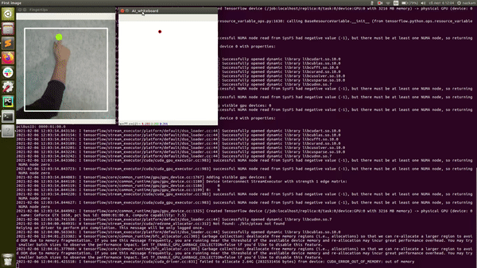

## Idea

The idea of this project is to transform any wall or surface into an interactive whiteboard just with an ordinary RGB camera and your hand.
I hope you'll find it interesting !

## Hardware

- Jetson Xavier NX **JetPack 4.4**
- Raspberry Pi Camera + ArduCam (8MP IMX219 Sensor Module)

**Note:** The system works also on Jetson Nano, TX2

## Details

To use AI whiteboard correctly you need to find a wall or flat surface and place a camera at a distance of about 1 meter. It can be any wall/surface but the system works more accurately with the dark or light monotonous walls/surfaces.
We capture an image from a camera. Then we crop this image into a square. Next, we use **a hand detector[1]  (YOLO[3] - deep neural network)**,to find a hand in the image. If there is a hand in the image, we crop that hand out of the image and feed it to **a Fingertip detector[1]  (modified VGG16 - deep neural network)**. Next, if we can detect fingertips, we use their coordinates to control the whiteboard (See the control section below). 

## Launch AI Whiteboard

##### 1. Set up your NVIDIA Jetson Device or use your PC.
- [Jetson Xavier NX](https://developer.nvidia.com/embedded/learn/get-started-jetson-xavier-nx-devkit) with [JetPack 4.4](https://developer.nvidia.com/jetpack-sdk-44-archive) (CUDA 10.2, TensorRT 7.1.3, cuDNN 8.0)
- [Install Tensorflow 1.15.3](https://docs.nvidia.com/deeplearning/frameworks/install-tf-jetson-platform/index.html)  

##### 2. Download AI Whiteboard project. `$ git clone https://github.com/preste-ai/camera_ai_whiteboard.git `
 
##### 3. Install packages

You can download needed packages via pip using the `requirements.txt` file:

```python
  pip3 install -r requirements.txt
```

##### 4. Download [weights or TensorRT engines](https://drive.google.com/drive/folders/1eDBqbZfoY7XJ3fYv8FEMJ5AZe_3n0sjU?usp=sharing) and put it to `weights` or `weights/engines`.

**Note:** The current TensorRT engines work correctly **only** on Jetson Xavier NX devices as TensorRT runs device-specific profiling during the optimization phase.If you want to use this models(engines) on others Jetson devices please convert .h5 model with `h5_to_trt.py` script on your platform. 

##### 5. Set up the power mode (ID=2, 15W 6 cores) `$ sudo /usr/sbin/nvpmodel -m 2`

##### 6. Launch device's fan `sudo jetson_clocks --fan` 

##### 7. Run AI whiteboard script. 

Check `config.py` file and set up needed parameters.
- whiteboard_w : 200 - whiteboard width (px) (displayed on camera caputed image)
- whiteboard_h : 200 - whiteboard height (px) (displayed on camera caputed image)
- cam_w       : 320 - width (px) of a captured image 
- cam_h       : 240 - height (px) of a captured image
- framerate   : 60 - camera capture framerate (for Raspberry Pi Camera)
- zoom_koef   : 2 - zoom coefficient to resize whiteboard_w and whiteboard_h
- confidence_ft_threshold : 0.5 - confidence threshold of Fingertips detector
- confidence_hd_threshold : 0.8 - confidence threshold of Hand detector      

---
Run from a project root directory:

**Jetson Devices**
```python 
  python3 ai_whiteboard.py --rpc --trt 
```
- rpc : If you want to use a Raspberry Pi Camera. Default: False
- trt : If you want to use TensorRT engines. Default: False

**Laptop**
```python
  python3 ai_whiteboard.py 
```

###### Control gesture (combination)
| To draw | To move | To erase | To clean | To save | 
|:---------------:|:---------------:|:---------------:|:---------------:|:---------------:|
|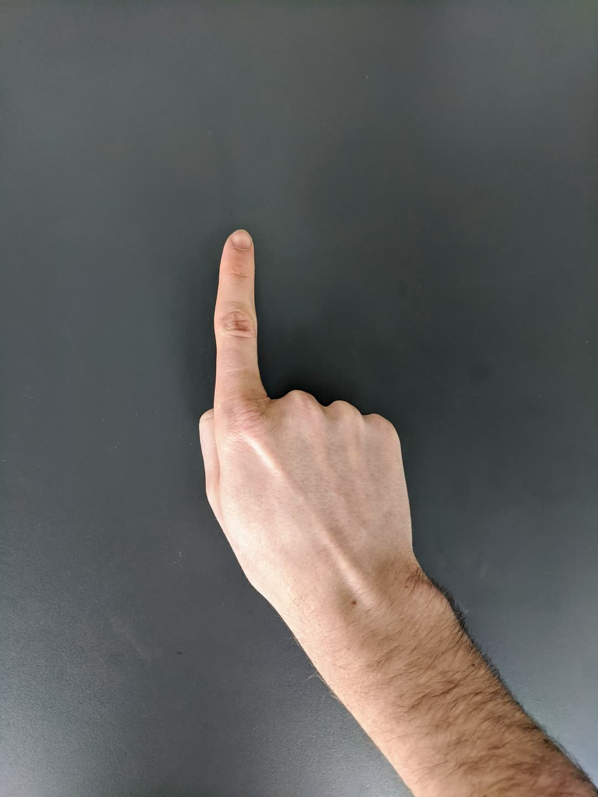|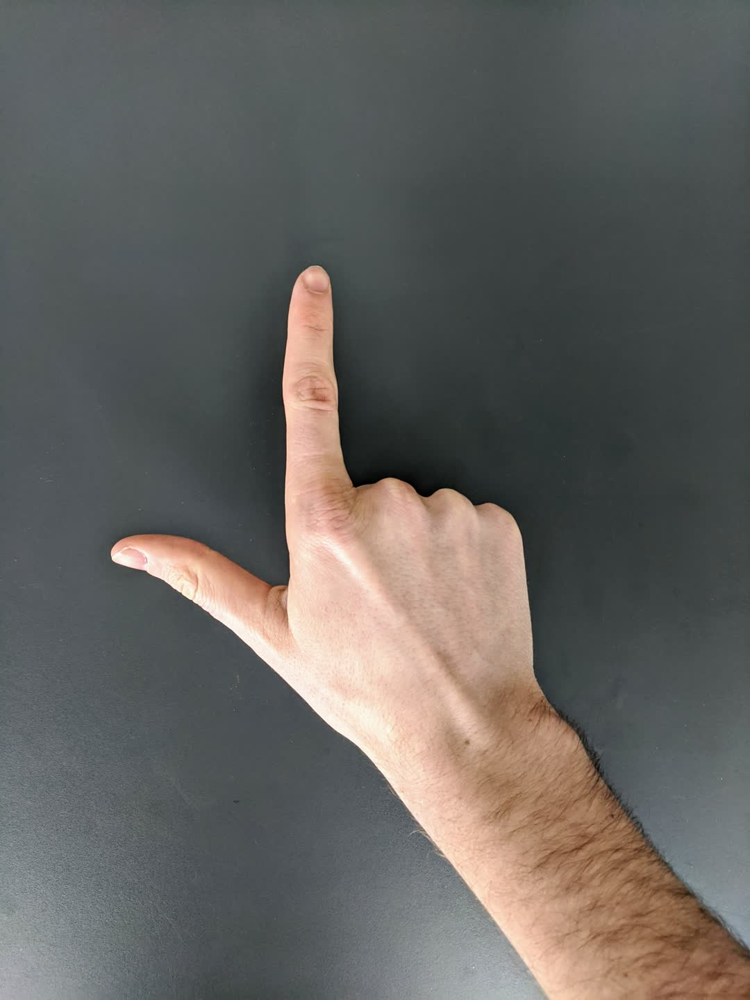|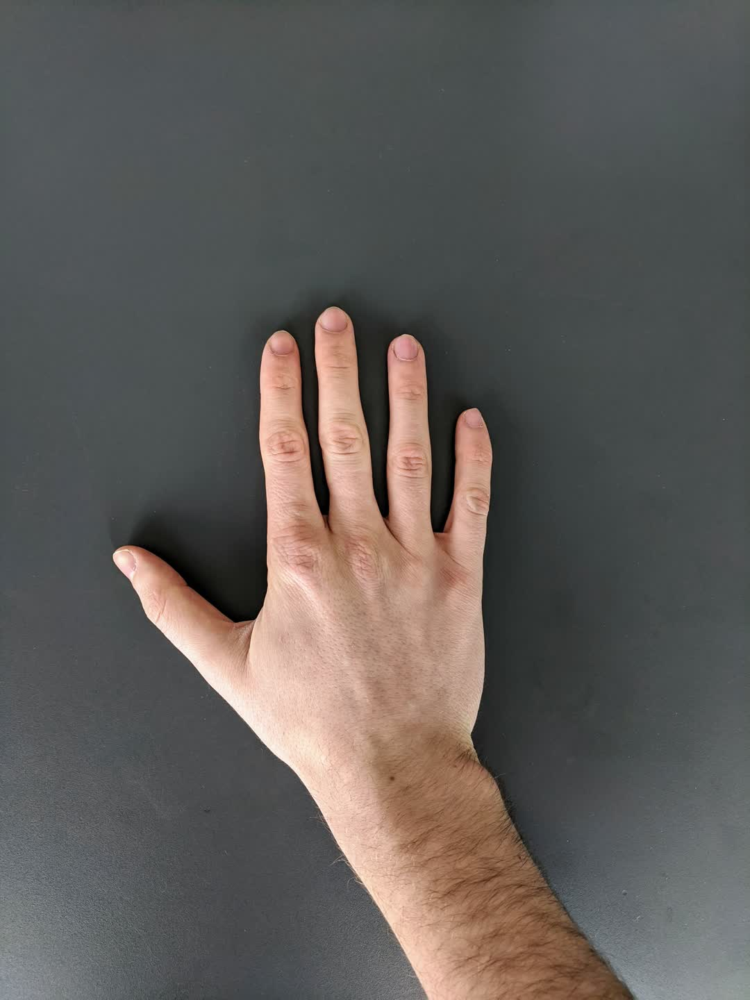|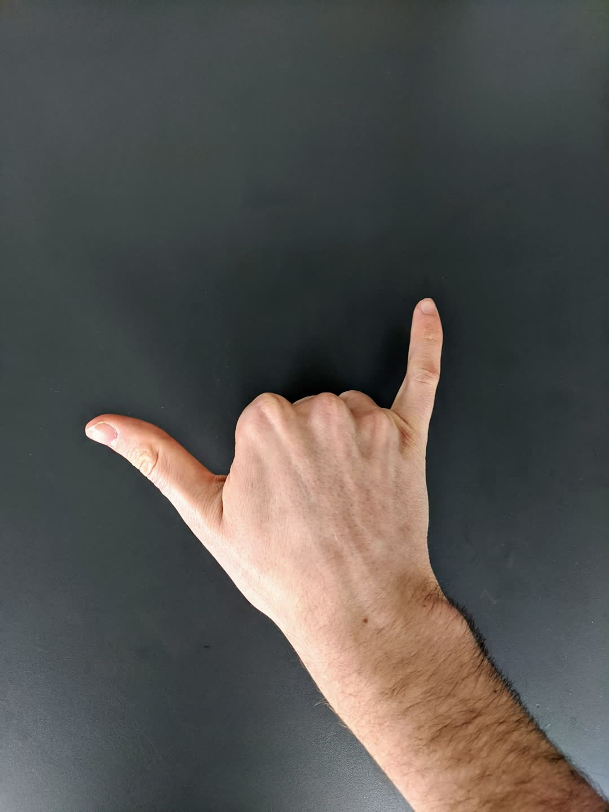|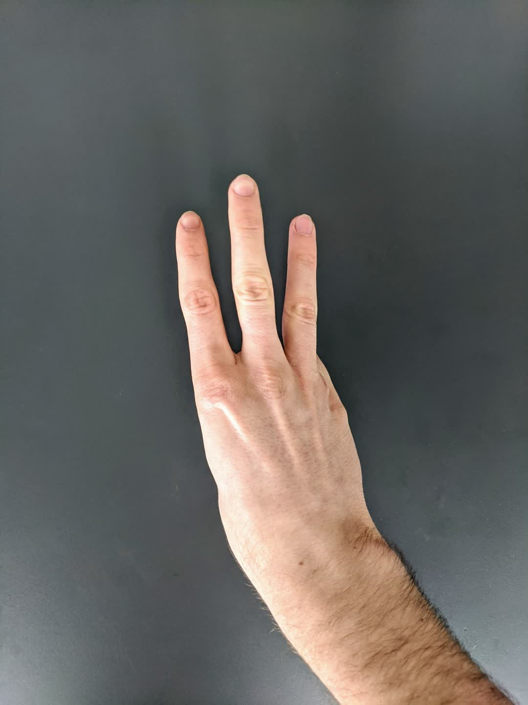|
 

## Training Hand-detector

#### Custom Dataset

A [custom dataset](https://drive.google.com/drive/folders/1rFHtl6A4EKokuOQk-9vqvWV0WiKyRfco?usp=sharing) was collected and labeled (12,000 images) for training. For labeling I used [CVAT](https://github.com/openvinotoolkit/cvat).

- Train: 9,500 images
- Validation: 1000 images
- Test : 1500 images

|  |  |  |  |  | 
|:---------------:|:---------------:|:---------------:|:---------------:|:---------------:|
|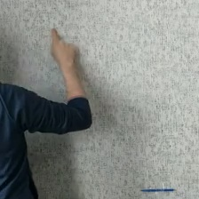|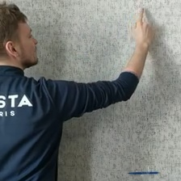|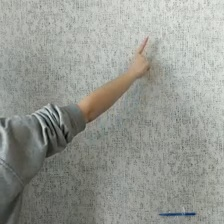|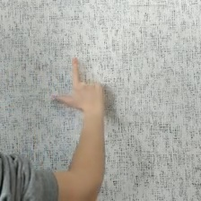||
|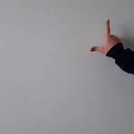|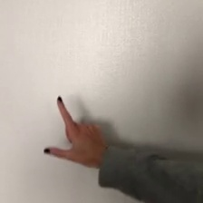|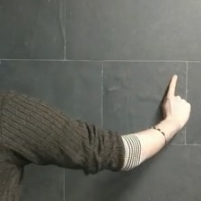|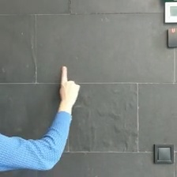|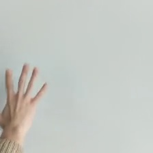|
 

Run from a project root directory:

```python
 python3 yolo_train.py
```


## Testing Hand-detector

Run from a project root directory:

```python
 python3 yolo_test.py
```

## Convert .h5 model to TensorRT engine [2]

The transformation takes place in 3 stages:
1. Freeze graph and remove training nodes (.h5 -> .pb)
2. Convert frozen graph to onnx (.pb -> .onnx)
3. Convert onnx model to TensorRT engine (.onnx -> .engine)

Run from a project root directory:

```python
  python3 h5_to_trt.py --folder weights --weights_file yolo --fp 16
```

- folder weights : path to the folder with model
- weights_file : weights file name (**without .h5**)
- fp : TensorRT engine precision (16 or 32)

Metrics for **Hand detection** after model conversion. 

In order to determine the correctness of the detection, we use the value of [IOU](https://medium.com/towards-artificial-intelligence/understanding-iou-metric-in-object-detection-1e5532f06a76). If the value of IOU is more than 0.5 then the detector predicts a hand correctly otherwise - no. The results are given below. 


|  | keras model before training | keras model after training | TensorRT engine (fp32) | TensorRT engine (fp16) | 
|:---------------:|:---------------:|:---------------:|:---------------:|:---------------:|
| Accuracy    | 72.68 % | 89.14 % | 89.14 % | 89.07 % |
| Precision   | 84.80 % | 99.45 % | 99.45 % | 99.45 % |
| Recall      | 50.78 % | 77.24 % | 77.24 % | 77.10 % |


## Solution performance (Hand detector + Fingertips detector)

Captured image shape : 320x240
Jetson Xavier NX: power mode ID 2: 15W 6 cores

|  | keras model | TensorRT engine (fp32) | TensorRT engine (fp16) | 
|:---------------:|:---------------:|:---------------:|:---------------:|
| Average FPS | 12 | 33 | 60 |


## References
1. Unified Gesture and Fingertip Detection : https://github.com/MahmudulAlam/Unified-Gesture-and-Fingertip-Detection
2. TensorRT guide: https://docs.nvidia.com/deeplearning/tensorrt/developer-guide/index.html#python_topics
3. YOLO9000: Better, Faster, Stronger : https://arxiv.org/abs/1612.08242
